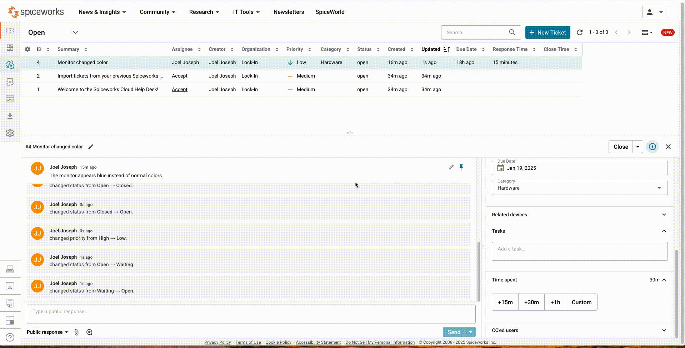

# IT Help Desk for Beginners 🌐

This repository documents insights and progress from the course **IT Help Desk for Beginners**, which serves as an introduction to IT support.

---

## Course Overview 📚

Interested in a job in IT? One of the best ways to break into the field is to land a role as an IT help desk technician. This course is an ideal starting point for anyone wishing to venture into the field of technical support or strengthen their technical savvy and improve technical skills. Instructor Robert McMillen covers the fundamentals of IT help desk responsibilities—including software, networking, and troubleshooting—as well as the soft skills required to become a successful customer service professional. Explore the responsibilities of a typical entry-level IT help desk technician, with tips from Robert on where the role can lead and how to scout out and obtain an official certification. By the end of this course, you’ll be equipped with the know-how to assess your professional options in remote, hybrid, and on-premises work environments.

---

## Demonstrations 🎯

Below are the demos that showcase basic functionalities of Spiceworks Ticketing system:

1. **Creating A Ticket In Spiceworks**  
   
   
2. **Escalating A Ticket In Spiceworks And Waiting For The User**  
   

---
## Repos for Course

---

## Key Takeaways 💡

- **Building Essential Skills:** The course provides foundational knowledge for entry-level IT help desk roles.  
- **Certification Guidance:** Highlights the importance of certifications like **CompTIA A+** for career advancement.  
- **Soft Skills Matter:** Emphasizes customer service and communication skills as critical components of success in IT.  

---
